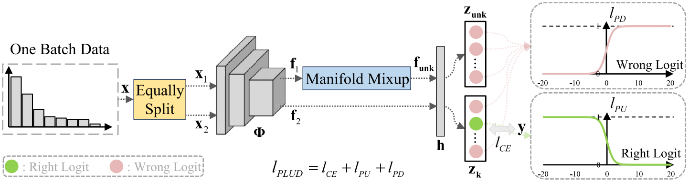

## Sonar-OLTR

**[English](https://github.com/Jorwnpay/Sonar-OLTR/blob/main/README.md)|简体中文**

这个仓库是我们在ESWA 2024上的文章："[Open-set recognition with long-tail sonar images](https://doi.org/10.1016/j.eswa.2024.123495)" 的实现代码。在本文中，提出了一个声纳图像开放集长尾识别（Sonar-OLTR）的基准，提出了一种简单有效的方法特征增强损失“Push the right Logit Up and the wrong logit Down (PLUD)”，以在训练过程中同时提高模型在开放集识别和长尾识别任务上的表现。



## 运行实验

### 主要依赖包

* Python == 3.6.12
* torch == 1.9.0
* torchvision == 0.10.0
* tensorboardX == 2.4.1

也可以通过下面的命令安装环境依赖：

```shell
pip install -r requirements.txt
```

我们推荐使用anaconda来构建您的代码环境.

### 实验环境

我们在一台配置了英特尔 Xeon E3-1275 v6 3.8 GHz CPU、32-GB RAM 和 **NVIDIA GeForce RTX 2080Ti** GPU的服务器上对代码进行了实验. 操作系统是 **Ubuntu 20.04**. CUDA 和 CUDNN 的版本分别为 **10.1** 和 **7.6.5**。

### 数据集

我们使用了long-tailed sonar image dataset (LTSID)和marine-debris-fls-datasets (FLSMDD)数据集来测试PLUD。FLSMDD数据集可以从[Valdenegro's repo](https://github.com/mvaldenegro/marine-debris-fls-datasets/releases/tag/watertank-v1.0)下载到。LTSID数据集是从网上收集整理得到的，由于版权问题，暂时不能开源。为了使用者的方便，预先准备好的FLSMDD数据集也可以从这个仓库里下载，只需克隆这个仓库并解压data文件夹下的所有`.rar`文件即可。**请注意：** 数据集是由Valdenegro提供的，我们这里仅仅是方便使用者跳过数据准备的步骤，直接运行代码进行实验。如果您准备在您的工作中使用这些数据集，请您引用他们的文章，并star他们的Github仓库，以对他们的贡献表示感谢。

```
% FLSMDD dataset is proposed in:
@inproceedings{valdenegro2021pre,
  title={Pre-trained models for sonar images},
  author={Valdenegro-Toro, Matias and Preciado-Grijalva, Alan and Wehbe, Bilal},
  booktitle={OCEANS 2021: San Diego--Porto},
  pages={1--8},
  year={2021},
  organization={IEEE}
}
```

我们发布了一个新的前视声纳图像数据集NanKai Sonar Image Dataset (NKSID)，包括8各类别共2617张图像。该数据集可从[Jorwnpay's repo](https://github.com/Jorwnpay/NK-Sonar-Image-Dataset)下载得到，所有的预先准备工作已经做好，只需将下载的NKSID文件夹放进`/Sonar-OLTR/data/`路径下，并解压`NKSID`路径下的所有`.zip`压缩包。

### 数据准备

如果您使用了[Valdenegro's repo](https://github.com/mvaldenegro/marine-debris-fls-datasets/releases/tag/watertank-v1.0)的原始数据集，请阅读这个准备步骤。请注意，如果您使用了这个仓库中准备好的数据集，仅需要解压data文件夹下的所有 `.rar` 文件，然后直接**跳过**这个步骤。

首先，从[Valdenegro's repo](https://github.com/mvaldenegro/marine-debris-fls-datasets/releases/tag/watertank-v1.0)下载数据集，并把原始文件的结构调整到下面这样：

```
data
├── FLSMDD
    ├── bottle
    │   ├── 1.png
    │   ├── 2.png
    │   └── ...
    ├── can
    │   ├── 1.png
    │   ├── 2.png
    │   └── ...
    └── ...
```

然后，运行下面的命令来生成 路径-标签 列表（train_abs.txt）和十次五折交叉验证的序号列表（kfold_train.txt, kfold_val.txt）。

```shell
# generate data direction-label list, use FLSMDD dataset as an example 
cd ./tool/
python generate_dir_lbl_list.py --dataset FLSMDD
# generate 10-trail 5-fold cross-validation index list, use FLSMDD dataset as an example 
python generate_kfold_idx_list.py --dataset FLSMDD
```

现在，你应该得到了这样的文件结构：

```
data
├── FLSMDD
    ├── train_abs.txt
    ├── kfold_train.txt
    ├── kfold_val.txt
    ├── bottle
    │   └── ...
    ├── can
    │   └── ...
    └── ...
```

### 训练

要训练PLUD，这里是一个快速开始的命令：

```shell
# Demo: training on NKSID
cd ./code/
python plud.py --dataset NKSID --train_class_num 5 --test_class_num 8
```

这里是一些重要参数的解释：

```shell
--dataset:      "the name of dataset, can be FLSMDD or NKSID, default is NKSID"
--lr: 			"learning rate, default is 0.01"
--backbone:     "the name of backbone, default is resnet18, can be resnet18, vit_base_patch16_224.orig_in21k_ft_in1k"
--bs:			"batch size, default is 32"
--es:			"epoch size, default is 100"
--p_value:      "the trail index of 10-trail 5-fold cross-validation, default is 0"
--k_value:      "the fold index of 10-trail 5-fold cross-validation, default is 0"
--train_class_num:			"Number of class used in training, default is 5"
--test_class_num:			"Number of class used in testing, default is 8"
--includes_all_train_class:	"If required all known classes included in testing"
--method_name:	"Method Name, default is plud"
--alpha:		"alpha value for beta distribution, default is 1.5"
--gamma:		"gamma value for plud loss, default is 0.5"
--save_results: "if you want to save the validation results, default is True"
--save_models:  "if you want to save the models, default is False"
```

通过下面的命令来对PLUD进行五次五折交叉验证训练：

```shell
# Demo: training on NKSID, using resnet18 as backbone
cd ./code/
python auto_run.py --code_dir plud.py --mode train --method_name plud
```

### 结果分析

在通过五次五折交叉验证训练完PLUD之后，您会得到y_true和logits结果，默认存放在`"/output/result/{dataset}/{method}/{backbone}/"`路径下，例如，`"/output/result/NKSID/plud/resnet18/y_true.txt"`。然后，您可以使用下面的命令来得到OSFM、Macro-F1、NMA、$OSCR_{macro}$结果：

```shell
# Demo: analyzing on NKSID, using resnet18 as backbone
cd ./code/
python analyse_result.py --dataset NKSID --method plud --backbone resnet18 --train_class_num 5 --test_class_num 8 
```

这里是一些重要参数的解释：

```shell
--dataset:          "the name of dataset, can be FLSMDD or NKSID, default is NKSID"
--method:           "the name of method, default is plud"
--backbone:         "the name of backbone, default is resnet18"
--thresh_mode:		"Choose a threshold mode for calculating y_hat from logit, default is tpr95"
--train_class_num:	"Number of class used in training, default is 5"
--test_class_num:	"Number of class used in testing, default is 8"
--get_osfm:         "If you want to get Macro-F1 and OSFM result, default is True."
--get_oscr:         "If you want to get OSCR result, default is True."
--get_oscr_curve:   "If you want to get OSCR curves result, default is False."
--get_nma:          "If you want to get NMA result, default is True."
--get_close_eval:   "If you want to get close-set Gmean and Macro-F1 result, default is False."
--show_pic:         "If you want to show confusion matrix or Precision-Recall curves, default is False"
```

您也可以通过`auto_run.py`对不同数据集里的多种方法进行批量结果分析：

```shell
# Demo
cd ./code/
python auto_run.py --code_dir analyse_result.py --mode analyse  
```

##  引用

如果您觉得这份代码对您的研究有帮助，请考虑引用我们：

```
@article{jiao2024open,
  title={Open-set recognition with long-tail sonar images},
  author={Jiao, Wenpei and Zhang, Jianlei and Zhang, Chunyan},
  journal={Expert Systems with Applications},
  pages={123495},
  year={2024},
  publisher={Elsevier}
}
```

